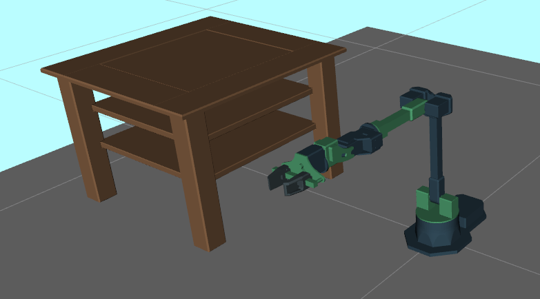

# Motion Planning for Car & Robotic Arm  
A collection of ROS-based motion-planning demos implementing **A\***, **RRT**, **RRT+Shortcut**, **Dubins-SE(2) A\***, and tradeoff analyses for both a wheeled vehicle and the Widowx250 robotic arm 

## Table of Contents

- [Overview](#overview)  
- [Features](#features)  
- [Demos](#demos) 
- [Acknowledgments](#acknowledgments)

---

## Overview

This repository contains algorithms for grid based motion planning using A* and RRT. The problems are based in R^2 and utilizes a a [NetworkX](https://networkx.org/) graph for the the mapping

## Features

- **RRT Planner**: Basic sampling-based planner with `--show-tree` visualization  
- **A\***: Optimal grid search with customizable sampler (`lattice` vs. `Halton`) 

---

## Demos

### Car Planning (2D)

*RRT path on `map1.txt

*A\* path on the same map using a lattice sampler.

---

### Arm Planning (6-DOF)

  
*Widowx250 planning scene in MoveIt!* :contentReference[oaicite:10]{index=10}  
---
### core implemention 
take a look at the core implementation
[**Plannning**]planning/src/planning/problems.py
